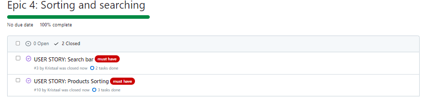
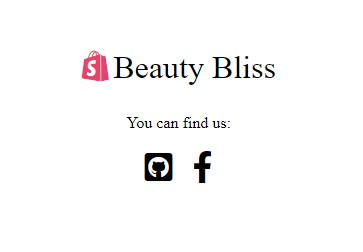
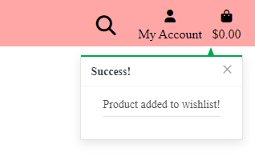
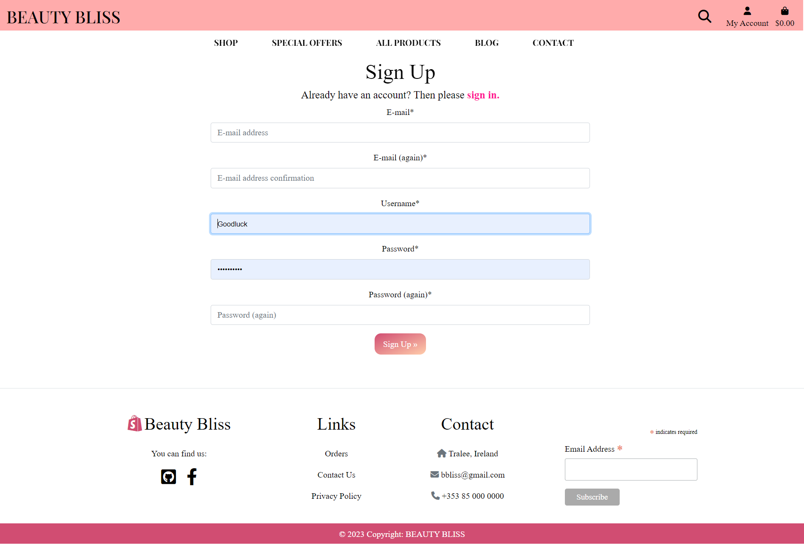

# Beauty Bliss Shop

**Developer: Kristina Orlichenko**

💻 [Visit live website](https://beautybliss.herokuapp.com/) 
 
💻 [Github Repository](https://github.com/Kristaal/ecommerce-website) 

## Table of Contents
- [Business Plan](#business-plan)
    - [Executive Summary](#executive-summary)
    - [Market Analysis](#market-analysis)
    - [Marketing and Sales Strategy](#marketing-and-sales-strategy)
    - [Operations and Management](#operations-and-management)
    - [Financial Plan](#financial-plan)
    - [Conclusion](#conclusion)
- [Marketing](#marketing)
    - [Mailing List](#mailing-list)
    - [Social Media](#social-media)
    - [Blog](#blog)
    - [Free Delivery](#free-delivery)
    - [SEO](#seo)
- [User Goals](#user-goals)
- [Site Owner Goals](#site-owner-goals)
- [User Experience](#user-experience)
    - [Target Audience](#target-audience)
    - [User Requirements and Expectations](#user-requirements-and-expectations)
- [User Stories](#user-stories)
    - [Kanban Epics and User Stories](#kanban-epics-user-stories)
- [Wireframes](#wireframes)
- [Design](#design)
    - [Colors](#colors)
    - [Fonts](#fonts)
- [Structure](#structure)
    - [Website pages](#website-pages)
- [AWS](#aws)
- [Database](#database)
- [Models](#models)
  - [Technologies Used](#technologies-used)
  - [Features](#features)
  - [Validation](#validation)
  - [Testing](#testing)
    - [Manual testing](#manual-testing)
    - [Automated testing](#automated-testing)
    - [Tests on various devices](#tests-on-various-devices)
    - [Browser compatibility](#browser-compatibility)
  - [Bugs](#bugs)
  - [Deployment](#deployment)
  - [Credits](#credits)
  - [Acknowledgements](#acknowledgements)

  

## Business Plan  
### Executive Summary:
Beauty Bliss is an online beauty shop that provides a wide range of beauty products to customers worldwide. Our mission is to offer high-quality beauty products at competitive prices while providing excellent customer service. We will achieve this by partnering with leading beauty brands and ensuring that our website is easy to navigate and user-friendly.

Our product range will include skincare, hair care, makeup, and fragrance products. We will offer a diverse range of products that cater to different skin types, hair textures, and personal preferences. Our team consists of experienced beauty professionals who will provide product recommendations and beauty advice to our customers.

Overall, Beauty Bliss aims to become a leading online beauty retailer by offering high-quality products, excellent customer service, and a user-friendly shopping experience.

### Market Analysis:
The beauty industry in Ireland is a growing market, driven by a growing population, increasing disposable incomes, and changing consumer preferences. The Irish beauty and personal care market was valued at €1.1 billion in 2019 and is expected to grow at a compound annual growth rate of 4.4% from 2020 to 2025.

The online beauty market in Ireland is also growing, with an increasing number of consumers turning to online shopping due to convenience, accessibility, and wider product options. According to a report by Mintel, 57% of Irish consumers purchased beauty products online in 2020, with skincare being the most popular category.

Beauty Bliss will target Irish consumers looking for high-quality beauty products at competitive prices. Our focus will be on providing a diverse range of products that cater to different skin types, hair textures, and personal preferences. We will also offer a range of international beauty brands that are not widely available in Ireland.

Overall, Beauty Bliss is well-positioned to capitalize on the growing demand for online beauty products in Ireland. We will leverage our competitive pricing, diverse product range, and excellent customer service to become a leading online beauty retailer in the Irish market.

### Marketing and Sales Strategy:
Our marketing and sales strategy for Beauty Bliss is focused on building brand awareness, driving traffic to our website, and providing a seamless customer experience that encourages repeat purchases. We will leverage online marketing channels and social media platforms such as SEO, PPC advertising, email marketing, Facebook, Instagram, and Twitter to reach our target audience and promote our high-quality and affordable beauty products.

### Operations and Management:
Beauty Bliss will be an online beauty shop, and our operations and management will be primarily focused on website management, product sourcing and inventory management, order fulfillment, customer service, and financial management.

We will leverage an e-commerce platform to manage our website, product listings, and orders. Our team will be responsible for managing our product inventory, ensuring that we have sufficient stock of our best-selling products, and sourcing new products that meet the needs and preferences of our customers.In terms of management, Beauty Bliss will be led by a team of experienced and dedicated individuals with a passion for the beauty industry. Our team will work together to execute our business plan, manage our operations, and provide our customers with the best possible shopping experience.

### Financial Plan:
The financial plan for Beauty Bliss is based on our projected revenue and expenses for the first three years of operation. Our revenue will come from online sales of beauty products, while our expenses will include the cost of goods sold, marketing expenses, website development and maintenance, and salaries.

Capital: €60,000

Revenue: €300,000 in Year 1

Gross Profit Margin: 40%

Average Fixed Cost: €30,000 per year

Average Variable Cost: €12,000 per year

Net Profit: €48,000 in Year 1

We will reinvest our profits back into the business to fund our growth and expansion plans.

Overall, our financial plan is based on realistic revenue and expense projections that are in line with industry averages and our expected growth rate. We will closely monitor our financial performance and adjust our strategies as needed to ensure the long-term success of Beauty Bliss.

### Conclusion:
Beauty Bliss is a promising online beauty shop that is poised for success in the Irish market. Our market analysis indicates that there is a growing demand for high-quality and affordable beauty products in Ireland, and we are well-positioned to meet this demand through our online platform.

We have developed a solid business plan that outlines our mission, goals, and strategies for achieving success. Our marketing and sales strategies are focused on building brand awareness, driving traffic to our website, and providing a seamless customer experience that encourages repeat purchases.

Our financial plan is based on realistic revenue and expense projections, and we will reinvest our profits back into the business to fund our growth and expansion plans. We will closely monitor our financial performance and adjust our strategies as needed to ensure the long-term success of Beauty Bliss.

In conclusion, we are excited about the potential of Beauty Bliss and look forward to serving the needs of the Irish market. We are committed to providing our customers with the highest quality beauty products, excellent customer service, and a convenient online shopping experience. With our dedicated team and strong business plan, we are confident that Beauty Bliss will become a leading online beauty shop in Ireland.

##### Back to [top](#table-of-contents)

## Marketing  

### Mailing List  

Beauty Bliss uses Mailchimp to manage its mailing list. By joining the mailing list, users will receive updates on new features, upcoming events, and exclusive promotions. The process to join the mailing list is simple, users just need to provide their email address on the website, and they will start receiving email updates. 

See Image

  

 
 

### Social Media  

The website Beauty Bliss has a presence on Facebook. The Facebook page serves as a platform to promote upcoming events, post updates on the latest features, and share user-generated content. This social media account allow users to stay informed.

[Facebook]()  

### Blog

Beauty Bliss provides a blog that will increase audience, attract buyers and increase sales.

See Image

  

 
 

### Free Delivery

We will offer free delivery on all orders above a certain threshold to incentivize customers to make a purchase. This will help us increase our average order value and encourage repeat purchases.

See Image

  

 
 

### SEO
In order to improve the sites search engine ranking two important files were added to the project :

A sitemap.xml file This file was added to help speed up content discovery for search engines when they crawl and index the web applications. A robots.txt file This fil was added to acknowledge that search engines are allowed on the site and that they may have free access to it. A robots.txt file is a simple text file that tells search engines where they are not allowed to go on a website. It lists out any folders or files that will not be crawled or indexed by search engine spiders.

[Robots.txt](robots.txt)  
[Sitemap.xml](sitemap.xml)  
 

##### Back to [top](#table-of-contents)

## User Goals

- Easily browsing and discovering new beauty products and trends
- Accessing detailed product information and reviews to make informed purchasing decisions
- Access to the latest news and trends of beauty industry through the blog
- Contact information for customer service and support, including phone, email
- Track user orders to have access to order information
- Save favorite products for future reference in wish list
- The payment options available, including any security measures in place to protect customer information.

## Site Owner Goals
- To create a visually appealing and user-friendly website that engages and converts visitors into loyal customers
- To offer a wide range of high-quality beauty products that cater to diverse tastes, needs, and budgets, ensuring customer satisfaction and loyalty
- To offer secure and seamless payment options that build trust and confidence among customers, reducing cart abandonment rates and increasing sales
- Generate revenue through the sale of products in the ecommerce shop

## User Experience
### Target Audience
- Beauty enthusiasts of all ages who are passionate about skincare, makeup, and other beauty products and are always looking for the latest trends and innovations in the industry
- Health and wellness seekers: people who prioritize natural and organic beauty products that align with their values and promote overall health and well-being
- Professionals in the beauty industry: makeup artists, hairstylists, estheticians, and other beauty professionals who need high-quality and reliable beauty products to serve their clients and grow their business
- Eco-conscious consumers: people who care about the environment and sustainability, and are looking for beauty products that are cruelty-free, vegan, or eco-friendly

### User Requirements and Expectations
- Intuitive and easy-to-use website: users expect a website that is easy to navigate and understand, with clear and concise menus, categories, and search options. They want a site that loads quickly and is responsive to their clicks and inputs
- Wide range of products: users want access to a diverse and extensive range of beauty products, from popular and well-known brands to niche and emerging ones. They expect products that are up-to-date, high-quality, and competitively priced
- Detailed product information: users expect detailed and accurate product descriptions, images, and customer reviews that help them make informed decisions about what to buy
- Secure and easy payment options: users expect secure and convenient payment option. They want to know that their personal and financial information is safe and protected
- Fast and reliable shipping: users expect fast and reliable shipping and delivery options, with clear and transparent tracking information. They want to know when their orders will arrive and be able to track them throughout the process
- Accessibility

##### Back to [top](#table-of-contents)

## User Stories
1. As a first time user I can see a website description so that should help me understand what the site is about
2. As a user I can navigate across the site so that can move to each feature of the site easily
3. As a shopper I can use a search on the website so that I can find specific product I would like to purchase
4. As a user I can look at footer so that I can see contact information, social links and website info
5. As a user I can easily register for an account so that I can have a personal account and be able to view my profile
6. As a user I can login and logout so that I can access my personal account information
7. As an shopper I can receive an email confirmation after registering so that I can verify that my account registration was successful
8. As a user I can have a profile so that I can store my information for faster checkouts
9. As a shopper I can view products so that I can choose something to buy
10. As a shopper  I can sort the list of available products so that I can identify the best rated, best priced and categorically sorted products
11. As a shopper  I can view individual product details so that I can identify the price, description, rating and view reviews
12. As an owner I can add new products to the store so that we can sell more items to our customers
13. As an owner I can remove items from the store so that customers no longer see items I do not intend to sell again
14. As an owner I can edit products so that products have the correct information and/or pricing
15. As a shopper  I can add products to bag so that I can review my items before I buy them
16. As a shopper I can remove items from my cart so that I can start my shopping again or decide against placing an order
17. As a shopper I can add to wishlist some products so that I can come back to wish list and buy interested products
18. As a shopper I can be interested in previous shopper experience so that I can choose a product according to the best reviews
19. As a shopper I can leave my own review on each product so that I can rate the product and write about its advantages or disadvantages
20. As a shopper I can easily enter my payment information so that I can check out quickly and with no hassles
21. As a shopper I can pay for product so that I can complete the payment through secure checkout
22. As a shopper I can see my orders so that I can track the progress of all my orders
23. As a shopper I can look at blog so that it provides me regular updates through published posts
24. As a shopper I can contact the business so that I can communicate with a person
25. As a user I can find the store's social networks so that see all the information and updates
26. As a shopper I can sign up for a newsletter so that I can get access to special offers or promotions
27. As a shopper I can quickly identify deals clearance items and special offers so that I can take advantage of special saving on products I'd like to purchase
28. As a shopper I can easily view the total of my purchases at any time so that avoid spending too much
29. As a user I can see my order history so that I always know what product I bought and have access to order the product again if I liked it
30. As a user I can receive am email from shop where I ordered items so that I always confirm my purchase and know what I ordered

### Kanban, Epics & User Stories

- GitHub Kanban was used to track all open user stories
- Epics were created using the milestones feature
- Backlog, In Progress, Done headings were used in the kanban

Epic Overview

Epic 1

Epic 2

Epic 3

Epic 4

Epic 5

Epic 6

User Stories

Kanban

##### Back to [top](#table-of-contents)

## Wireframes

Balsamiq was used to create wireframes for this project.

### Home Page

Wireframe Home

### Products Page

Wireframe Products

### Product Details Page

Wireframe Product Details

### Bag Page

Wireframe Bag

### Profile Page

Wireframe Profile

### Wishlist Page

Wireframe Wishlist

### Blog Page

Wireframe Blog

### Contact Page

Wireframe Contact

##### Back to [top](#table-of-contents)

## Design

### Colors

The Beauty Bliss website have a color scheme that is related to beauty, sweetness, femininity and makeup products. The website incorporates softer and vibrant shades of pink and combined with other colors, such as white and black to create a cohesive and visually appealing color palette that reflects the brand's identity and values. This can create a sense of elegance and sophistication that aligns with the beauty industry's aesthetics.

See Color Palette

 

### Fonts

The font was selected from Google Fonts, Playfair Display and Lato.It is a popular choice for headings, titles, and other display purposes, as it has a classic and elegant look that is well-suited to a range of design styles. The font's unique combination of thick and thin strokes, along with its generous spacing and high contrast, give it a distinct and sophisticated appearance.

##### Back to [top](#table-of-contents)

## Structure

The site was designed for the user to be familiar with the layout such as a navigation bar along the top of the pages and a hamburger menu button for smaller screen.
The pages are structured in a user-friendly and easy-to-learn way. Upon arriving at the website the user sees the home page, with a call to action.

## Website pages
The site consists of the following pages:

- Home page
- Products page
- Product details page
- Blog page
- Post details page
- Contact page
- Register page
- Login page
- Logout page
- Profile page
- Wishlist page
- Bag page
- Checkout page
- Checkout success page

##### Back to [top](#table-of-contents)

## AWS 

AWS S3 bucket was chosen to store website static and media data. It's a reliable, scalable, and inexpensive cloud computing service. This service allows to easily store static and media files and provides protection for my data.

See AWS Images

 

##### Back to [top](#table-of-contents)

## Database

See Database Image

## Models  

User Model

| Key        | Name         | Type        |
| ---------- | ------------ | ----------- |
| PrimaryKey | user_id      | AutoField   |
|            | password     | VARCHAR(45) |
|            | last_login   | VARCHAR(45) |
|            | is_superuser | BOOLEAN     |
|            | username     | VARCHAR(45) |
|            | first_name   | VARCHAR(45) |
|            | last_name    | VARCHAR(45) |
|            | email        | VARCHAR(45) |
|            | is_staff     | BOOLEAN     |
|            | is_active    | BOOLEAN     |
|            | date_joined  | VARCHAR(45) |

User Profile Model

| Key        | Name                 | Type          |
| ---------- | -------------------- | ------------- |
| PrimaryKey | user_profile_id      | AutoField     |
| ForeignKey | user                 | User model    |
|            | default_phone_number | CharField[20] |
|            | default_street_address1| CharField[80] |
|            | default_street_address2 | CharField[80] |
|            | default_town_or_city | CharField[40] |
|            | default_county       | CharField[80] |
|            | default_postcode     | CharField[20] |
|            | default_country      | CountryField |

Products Model

| Key        | Name        | Type           |
| ---------- | ----------- | -------------- |
| PrimaryKey | product_id  | AutoField      |
| ForeignKey | category    | Category model |
|            | sku         | CharField[254] |
|            | name        | CharField[254] |
|            | description | TextField      |
|            | has_sizes   | BooleanField   |
|            | price       | DecimalField   |
|            | rating      | DecimalField   |
|            | image_url   | URLField       |
|            | image       | ImageField     |

Category Model

| Key        | Name        | Type             |
| ---------- | ----------- | --------------   |
| PrimaryKey | id          | AutoField        |
|            | name        | CharField[150]   |
|            | friendly_name | CharField[254] |

Product Review Model

| Key        | Name        | Type           |
| ---------- | ----------- | -------------- |
| PrimaryKey | review_id   | AutoField      |
| ForeignKey | product     | Product model  |
| ForeignKey | user        | User model  |
|            | content     | TextField      |
|            | stars       | IntegerField   |
|            | date        | DateTimeField  |

Wishlist Model

| Key        | Name        | Type                |
| ---------- | ----------- | --------------      |
| PrimaryKey | wishlist_id | AutoField           |
| ForeignKey | product     | Product model       |
| ForeignKey | user        | User model          |

Post Model

| Key        | Name           | Type           |
| ---------- | -----------    | -------------- |
| PrimaryKey | post_id        | AutoField      |
|            | title          | CharField[100] |
|            | content        | TextField      |
|            | excerpt        | TextField      |
|            | featured_image | ImageField     |
|            | date_created   | DateTimeField  |

Contact Model

| Key        | Name        | Type             |
| ---------- | ----------- | --------------   |
| PrimaryKey | id          | AutoField        |
|            | name        | CharField[150]   |
|            | email       | EmailField       |
|            | reason      | CharField[15]    |
|            | message     | TextField        |

Order Model

| Key        | Name            | Type               |
| ---------- | --------------- | ------------------ |
| PrimaryKey | order_id        | AutoField          |
|            | order_number    | CharField[32]      |
| ForeignKey | user_profile    | UserProfile Model |
|            | full_name       | CharField[50]      |
|            | email           | EmailField[254]    |
|            | phone_number    | CharField[20]      |
|            | country         | CountryField       |
|            | postcode        | CharField[20]      |
|            | town_or_city    | CharField[40]      |
|            | street_address1 | CharField[80]      |
|            | street_address2 | CharField[80]      |
|            | county          | CharField[80]      |
|            | date            | DateTimeField      |
|            | delivery_cost   | DecimalField[6]    |
|            | order_total     | DecimalField[10]   |
|            | grand_total     | DecimalField[10]   |
|            | original_bag    | TextField          |
|            | stripe_pid      | CharField          |

OrderLineItem Model

| Key        | Name             | Type            |
| ---------- | ---------------- | --------------- |
| PrimaryKey | OrderLineItem_id | AutoField       |
| ForeignKey | order            | Order Model     |
| ForeignKey | product          | Product Model   |
| ForeignKey | product_size     | CharField       |
|            | quantity         | IntegerField    |
|            | lineitem_total  | DecimalField[6] |

##### Back to [top](#table-of-contents)

## Technologies Used

### Languages & Frameworks

- HTML
- CSS
- Javascript
- Python
- Django

### Libraries & Tools

- [Am I Responsive](http://ami.responsivedesign.is/)
- [Balsamiq](https://balsamiq.com/)
- [Bootstrap v4.6.2](https://getbootstrap.com/)
- [Cloudinary](https://cloudinary.com/)
- [Favicon.io](https://favicon.io)
- [Chrome dev tools](https://developers.google.com/web/tools/chrome-devtools/)
- [Font Awesome](https://fontawesome.com/)
- [Git](https://git-scm.com/)
- [GitHub](https://github.com/)
- [Google Fonts](https://fonts.google.com/)
- [Heroku Platform](https://id.heroku.com/login)
- [AWS](https://aws.amazon.com/)
- [jQuery](https://jquery.com)
- [Postgres](https://www.postgresql.org/)
- [Summernote](https://summernote.org/)
- Validation:
  - [WC3 Validator](https://validator.w3.org/)
  - [Jigsaw W3 Validator](https://jigsaw.w3.org/css-validator/)
  - [JShint](https://jshint.com/)
  - [CI Python Liner(PEP8)](https://pep8ci.herokuapp.com/)
  - [Lighthouse](https://developers.google.com/web/tools/lighthouse/)
  - [Wave Validator](https://wave.webaim.org/)

##### Back to [top](#table-of-contents)

## Features  

### Search Engine Optimisation (SEO)

I used meta keywords that make it possible for people to find my site via search engines. Keywords are ideas and topics that define what my website content is about.

See feature image

  

### Logo

- A custom logo for the business included only letters.
- User stories covered: 

See feature images

  

### Home page

- Home page includes navbar, main website slider with images, main text, button "Shop now" and a footer with website information.
- User stories covered: 

See feature images

  

### Navigation
  - Navbar includes links to all products, blog page, contact page, bag, profile page, and wish list
  - Navbar has search field for products searching
  - Indicates login/logout and register in status.
  - Fully Responsive.
  - On small screens switches to hamburger menu.
  - Displayed on all pages
  - User stories covered:

See feature images

  

### Search
- Allows the user to search for products.  
- User stories covered: 

See feature image

  

### Footer
- Contains social media links, links, privacy policy, contacts and newsletter, 
- displayed across all pages.  
- User stories covered: 

See feature images

 

### Mailing List Sign Up
- Mailchimp signup for email mailing list. 
- User stories covered:  

See feature images

### Social Media Links
- A link is used for the Facebook business page.
- All links open in a new tab to ensure the user is not directed away from the business.
- noopener, noreferrer, nofollow used to communicate with web crawlers and for security and privacy concerns.  
- User stories covered: 
  

See feature image

### Products  page
  - Products list page contains all products cards, buttons to sort by categories.
  - User allowed to add each product to bag or put it in wish list.
  - User stories covered: 

See feature images

### Sorting field
- Allows the user to sort the listed products.  
- User stories covered: 

See feature images

  

### Products details
  - Products details page contains product image, description, quantity input, add to bag button.
  - Page provides add to wish list button.
  - User allowed to add product to wish list or remove accordingly.
  - User stories covered: 

See feature images

### Add to wishlist
  - Allows the User to add products to the wishlist
  - User stories covered: 

See feature images

### Reviews
- Only registered users can leave a reviews on product
- User stories covered: 
  

See feature images

### Add Product
  - Allows the Admin to add new products.
  - User stories covered: 

See feature images

### Edit Product
  - Allows the Admin to edit the products.
  - User stories covered: 

See feature images

### Delete Product
  - Allows the Admin to delete products, includes confirmation message before deletion.
  - User stories covered: 

See feature images

### Bag
  - Contains all products which user selected to buy
  - User can change item quantity
  - User can go to secure checkout page by click on button
  - User stories covered: 

See feature images

### Checkout
  - Allows the user to purchase items in their bag.
  - User stories covered: 

See feature images

### Stripe
  - Allows the user to use stripe for card payments.
  - User stories covered: 

See feature images

### Email Confirmation
  - Allows the user to receive an email confirmation for their order.
  - User stories covered: 

See feature images

### Checkout success
  - Shows the page confirmation with user order.
  - User stories covered: 

See feature images

### Blog page

  - Blog page contains posts cards with images and post title on each card.
  - Blog page includes pagination for 6 posts on the page
  - User stories covered: 

See feature images

### Pagination
- Blog page includes pagination for 6 posts on the page
- Ensures the page is kept tidy  
  

See feature images

### Post details page

  - Post details page provides post content.
  - User stories covered: 

See feature images

### Contact page

  - Contact page contains message form, contact information and google map with mark on it for the business.
  - Only loged in users can send a message to website owner.
  - User stories covered: 

See feature images

### Map

  - Contact page contains map with address of the business.
  - User stories covered: 

See feature images

### Wishlist

  - Allows user to add favourite items to wished list
  - User can delete item from wish list or add it to bag
  - Wishlist works on all products page and in product details
  - User stories covered: 

See feature images

### Profile 

  - Allows the user to update their information and see their order history.
  - User stories covered: 

See feature images

### Notifications container
  - Allows the user to see relevant notifications.
  - User stories covered: 

See feature images

### Sign up / Register

- Allow users to register an acoount.
- User stories covered: 

See feature image

### Sign In

- User can sign in.  
- User stories covered: 

See feature images

### Sign Out

- Allows the user to securely sign out.
- Ask user if they are sure they want to sign out.  
- User stories covered: 

See feature image

  

##### Back to [top](#table-of-contents)

# Validation  

## HTML Validation

The [W3C Markup Validation Service](https://validator.w3.org/) was used to validate the HTML code of the website. 

### Home page

Home page

### Products page

Products page

### Product details page

Product details page

### Add product page

Add product page

### Edit product page

Edit product page

### Bag page

Bag page

### Checkout page

Checkout page

### Checkout success page

Checkout success page

### Blog page

Blog page

### Contact page

Contact page

### Profile page

Profile page

### Wishlist page

Wishlist page

### Register page

Signup page

### Log In page

Login page

### Log Out page

Logout page

##### Back to [top](#table-of-contents)
 

### CSS Validation

The [W3C Jigsaw CSS Validation Service](https://jigsaw.w3.org/css-validator/) was used to validate the CSS of the website.

base.css

 

blog.css

 

checkout.css

profiles.css

 

### JavaScript Validation

##### Back to [top](#table-of-contents)
  

## PEP8 Validation

##### Back to [top](#table-of-contents)
  

## Accessibility  

##### Back to [top](#table-of-contents)
  

## Lighthouse

##### Back to [top](#table-of-contents)

## Testing

1. Manual testing User Stories
2. Automated testing

### Manual testing

### Automated testing

### Coverage  

### Device Testing & Browser compatibility

##### Back to [top](#table-of-contents)

## Bugs

##### Back to [top](#table-of-contents)

## Deployment  

##### Back to [top](#table-of-contents)

## Credits

### Code

### Media

##### Back to [top](#table-of-contents)

## Acknowledgements

### Special thanks to the following: