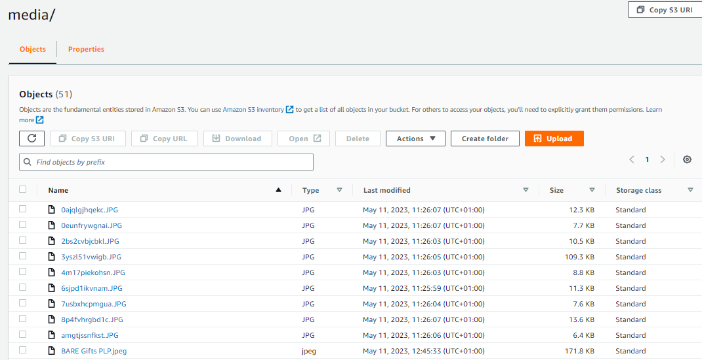
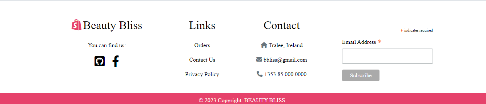
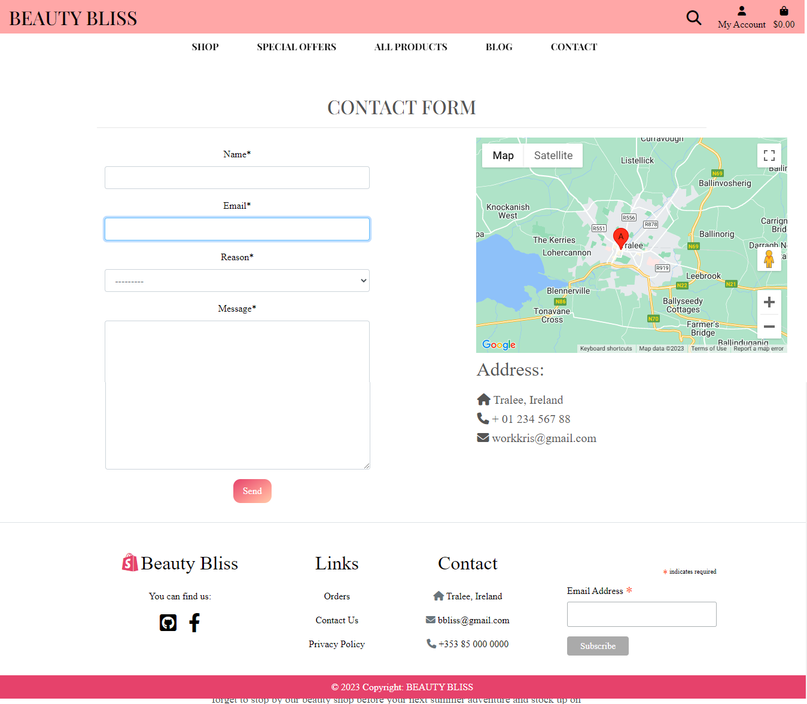
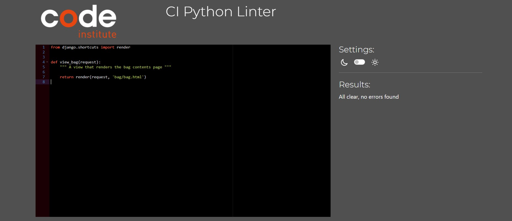
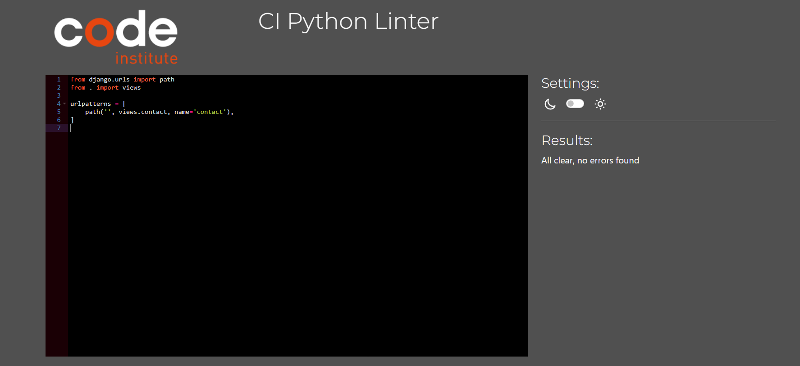
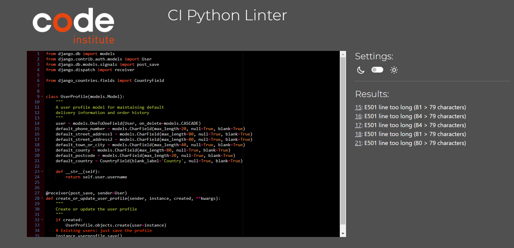
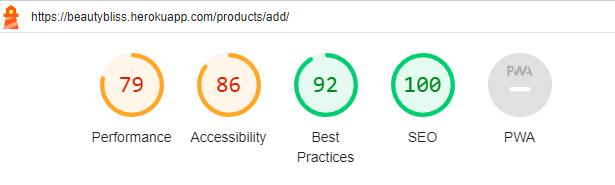
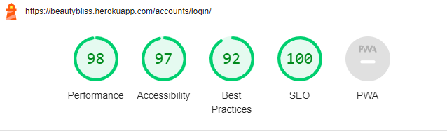

# Beauty Bliss Shop

**Developer: Kristina Orlichenko**

💻 [Visit live website](https://beautybliss.herokuapp.com/) 
 
💻 [Github Repository](https://github.com/Kristaal/ecommerce-website) 

## Table of Contents
- [Business Plan](#business-plan)
    - [Executive Summary](#executive-summary)
    - [Market Analysis](#market-analysis)
    - [Marketing and Sales Strategy](#marketing-and-sales-strategy)
    - [Operations and Management](#operations-and-management)
    - [Financial Plan](#financial-plan)
    - [Conclusion](#conclusion)
- [Marketing](#marketing)
    - [Mailing List](#mailing-list)
    - [Social Media](#social-media)
    - [Blog](#blog)
    - [Free Delivery](#free-delivery)
    - [SEO](#seo)
- [User Goals](#user-goals)
- [Site Owner Goals](#site-owner-goals)
- [User Experience](#user-experience)
    - [Target Audience](#target-audience)
    - [User Requirements and Expectations](#user-requirements-and-expectations)
- [User Stories](#user-stories)
    - [Kanban Epics and User Stories](#kanban-epics-user-stories)
- [Wireframes](#wireframes)
- [Design](#design)
    - [Colors](#colors)
    - [Fonts](#fonts)
- [Structure](#structure)
    - [Website pages](#website-pages)
- [AWS](#aws)
- [Database](#database)
- [Models](#models)
- [Technologies Used](#technologies-used)
- [Features](#features)
- [Validation](#validation)
- [Testing](#testing)
    - [Manual testing](#manual-testing)
    - [Tests on various devices](#tests-on-various-devices)
    - [Browser compatibility](#browser-compatibility)
- [Bugs](#bugs)
- [Deployment](#deployment)
- [Credits](#credits)
- [Acknowledgements](#acknowledgements)

  

## Business Plan  
### Executive Summary:
Beauty Bliss is an online beauty shop that provides a wide range of beauty products to customers worldwide. Our mission is to offer high-quality beauty products at competitive prices while providing excellent customer service. We will achieve this by partnering with leading beauty brands and ensuring that our website is easy to navigate and user-friendly.

Our product range will include skincare, hair care, makeup, and fragrance products. We will offer a diverse range of products that cater to different skin types, hair textures, and personal preferences. Our team consists of experienced beauty professionals who will provide product recommendations and beauty advice to our customers.

Overall, Beauty Bliss aims to become a leading online beauty retailer by offering high-quality products, excellent customer service, and a user-friendly shopping experience.

### Market Analysis:
The beauty industry in Ireland is a growing market, driven by a growing population, increasing disposable incomes, and changing consumer preferences. The Irish beauty and personal care market was valued at €1.1 billion in 2019 and is expected to grow at a compound annual growth rate of 4.4% from 2020 to 2025.

The online beauty market in Ireland is also growing, with an increasing number of consumers turning to online shopping due to convenience, accessibility, and wider product options. According to a report by Mintel, 57% of Irish consumers purchased beauty products online in 2020, with skincare being the most popular category.

Beauty Bliss will target Irish consumers looking for high-quality beauty products at competitive prices. Our focus will be on providing a diverse range of products that cater to different skin types, hair textures, and personal preferences. We will also offer a range of international beauty brands that are not widely available in Ireland.

Overall, Beauty Bliss is well-positioned to capitalize on the growing demand for online beauty products in Ireland. We will leverage our competitive pricing, diverse product range, and excellent customer service to become a leading online beauty retailer in the Irish market.

### Marketing and Sales Strategy:
Our marketing and sales strategy for Beauty Bliss is focused on building brand awareness, driving traffic to our website, and providing a seamless customer experience that encourages repeat purchases. We will leverage online marketing channels and social media platforms such as SEO, PPC advertising, email marketing, Facebook, Instagram, and Twitter to reach our target audience and promote our high-quality and affordable beauty products.

### Operations and Management:
Beauty Bliss will be an online beauty shop, and our operations and management will be primarily focused on website management, product sourcing and inventory management, order fulfillment, customer service, and financial management.

We will leverage an e-commerce platform to manage our website, product listings, and orders. Our team will be responsible for managing our product inventory, ensuring that we have sufficient stock of our best-selling products, and sourcing new products that meet the needs and preferences of our customers.In terms of management, Beauty Bliss will be led by a team of experienced and dedicated individuals with a passion for the beauty industry. Our team will work together to execute our business plan, manage our operations, and provide our customers with the best possible shopping experience.

### Financial Plan:
The financial plan for Beauty Bliss is based on our projected revenue and expenses for the first three years of operation. Our revenue will come from online sales of beauty products, while our expenses will include the cost of goods sold, marketing expenses, website development and maintenance, and salaries.

Capital: €60,000

Revenue: €300,000 in Year 1

Gross Profit Margin: 40%

Average Fixed Cost: €30,000 per year

Average Variable Cost: €12,000 per year

Net Profit: €48,000 in Year 1

We will reinvest our profits back into the business to fund our growth and expansion plans.

Overall, our financial plan is based on realistic revenue and expense projections that are in line with industry averages and our expected growth rate. We will closely monitor our financial performance and adjust our strategies as needed to ensure the long-term success of Beauty Bliss.

### Conclusion:
Beauty Bliss is a promising online beauty shop that is poised for success in the Irish market. Our market analysis indicates that there is a growing demand for high-quality and affordable beauty products in Ireland, and we are well-positioned to meet this demand through our online platform.

We have developed a solid business plan that outlines our mission, goals, and strategies for achieving success. Our marketing and sales strategies are focused on building brand awareness, driving traffic to our website, and providing a seamless customer experience that encourages repeat purchases.

Our financial plan is based on realistic revenue and expense projections, and we will reinvest our profits back into the business to fund our growth and expansion plans. We will closely monitor our financial performance and adjust our strategies as needed to ensure the long-term success of Beauty Bliss.

In conclusion, we are excited about the potential of Beauty Bliss and look forward to serving the needs of the Irish market. We are committed to providing our customers with the highest quality beauty products, excellent customer service, and a convenient online shopping experience. With our dedicated team and strong business plan, we are confident that Beauty Bliss will become a leading online beauty shop in Ireland.

##### Back to [top](#table-of-contents)

## Marketing  

### Mailing List  

Beauty Bliss uses Mailchimp to manage its mailing list. By joining the mailing list, users will receive updates on new features, upcoming events, and exclusive promotions. The process to join the mailing list is simple, users just need to provide their email address on the website, and they will start receiving email updates. 

See Image

  

 
 

### Social Media  

The website Beauty Bliss has a presence on Facebook. The Facebook page serves as a platform to promote upcoming events, post updates on the latest features, and share user-generated content. This social media account allow users to stay informed.

[Facebook](https://www.facebook.com/profile.php?id=100092848533079)  

### Blog

Beauty Bliss provides a blog that will increase audience, attract buyers and increase sales.

See Image

  

 
 

### Free Delivery

We will offer free delivery on all orders above a certain threshold to incentivize customers to make a purchase. This will help us increase our average order value and encourage repeat purchases.

See Image

  

 
 

### SEO
In order to improve the sites search engine ranking two important files were added to the project :

A sitemap.xml file This file was added to help speed up content discovery for search engines when they crawl and index the web applications. A robots.txt file This fil was added to acknowledge that search engines are allowed on the site and that they may have free access to it. A robots.txt file is a simple text file that tells search engines where they are not allowed to go on a website. It lists out any folders or files that will not be crawled or indexed by search engine spiders.

[Robots.txt](robots.txt)  
[Sitemap.xml](sitemap.xml)  
 

##### Back to [top](#table-of-contents)

## User Goals

- Easily browsing and discovering new beauty products and trends
- Accessing detailed product information and reviews to make informed purchasing decisions
- Access to the latest news and trends of beauty industry through the blog
- Contact information for customer service and support, including phone, email
- Track user orders to have access to order information
- Save favorite products for future reference in wish list
- The payment options available, including any security measures in place to protect customer information.

## Site Owner Goals
- To create a visually appealing and user-friendly website that engages and converts visitors into loyal customers
- To offer a wide range of high-quality beauty products that cater to diverse tastes, needs, and budgets, ensuring customer satisfaction and loyalty
- To offer secure and seamless payment options that build trust and confidence among customers, reducing cart abandonment rates and increasing sales
- Generate revenue through the sale of products in the ecommerce shop

## User Experience
### Target Audience
- Beauty enthusiasts of all ages who are passionate about skincare, makeup, and other beauty products and are always looking for the latest trends and innovations in the industry
- Health and wellness seekers: people who prioritize natural and organic beauty products that align with their values and promote overall health and well-being
- Professionals in the beauty industry: makeup artists, hairstylists, estheticians, and other beauty professionals who need high-quality and reliable beauty products to serve their clients and grow their business
- Eco-conscious consumers: people who care about the environment and sustainability, and are looking for beauty products that are cruelty-free, vegan, or eco-friendly

### User Requirements and Expectations
- Intuitive and easy-to-use website: users expect a website that is easy to navigate and understand, with clear and concise menus, categories, and search options. They want a site that loads quickly and is responsive to their clicks and inputs
- Wide range of products: users want access to a diverse and extensive range of beauty products, from popular and well-known brands to niche and emerging ones. They expect products that are up-to-date, high-quality, and competitively priced
- Detailed product information: users expect detailed and accurate product descriptions, images, and customer reviews that help them make informed decisions about what to buy
- Secure and easy payment options: users expect secure and convenient payment option. They want to know that their personal and financial information is safe and protected
- Fast and reliable shipping: users expect fast and reliable shipping and delivery options, with clear and transparent tracking information. They want to know when their orders will arrive and be able to track them throughout the process
- Accessibility

##### Back to [top](#table-of-contents)

## User Stories
1. As a first time user I can see a website description so that should help me understand what the site is about
2. As a user I can navigate across the site so that can move to each feature of the site easily
3. As a shopper I can use a search on the website so that I can find specific product I would like to purchase
4. As a user I can look at footer so that I can see contact information, social links and website info
5. As a user I can easily register for an account so that I can have a personal account and be able to view my profile
6. As a user I can login and logout so that I can access my personal account information
7. As an shopper I can receive an email confirmation after registering so that I can verify that my account registration was successful
8. As a user I can have a profile so that I can store my information for faster checkouts
9. As a shopper I can view products so that I can choose something to buy
10. As a shopper  I can sort the list of available products so that I can identify the best rated, best priced and categorically sorted products
11. As a shopper  I can view individual product details so that I can identify the price, description, rating and view reviews
12. As an owner I can add new products to the store so that we can sell more items to our customers
13. As an owner I can remove items from the store so that customers no longer see items I do not intend to sell again
14. As an owner I can edit products so that products have the correct information and/or pricing
15. As a shopper  I can add products to bag so that I can review my items before I buy them
16. As a shopper I can remove items from my cart so that I can start my shopping again or decide against placing an order
17. As a shopper I can add to wishlist some products so that I can come back to wish list and buy interested products
18. As a shopper I can be interested in previous shopper experience so that I can choose a product according to the best reviews
19. As a shopper I can leave my own review on each product so that I can rate the product and write about its advantages or disadvantages
20. As a shopper I can easily enter my payment information so that I can check out quickly and with no hassles
21. As a shopper I can pay for product so that I can complete the payment through secure checkout
22. As a shopper I can see my orders so that I can track the progress of all my orders
23. As a shopper I can look at blog so that it provides me regular updates through published posts
24. As a shopper I can contact the business so that I can communicate with a person
25. As a user I can find the store's social networks so that see all the information and updates
26. As a shopper I can sign up for a newsletter so that I can get access to special offers or promotions
27. As a shopper I can quickly identify deals clearance items and special offers so that I can take advantage of special saving on products I'd like to purchase
28. As a shopper I can easily view the total of my purchases at any time so that avoid spending too much
29. As a user I can see my order history so that I always know what product I bought and have access to order the product again if I liked it
30. As a user I can receive am email from shop where I ordered items so that I always confirm my purchase and know what I ordered

### Kanban, Epics & User Stories

- GitHub Kanban was used to track all open user stories
- Epics were created using the milestones feature
- Backlog, In Progress, Done headings were used in the kanban

Epic Overview

Epic 1

Epic 2

Epic 3

Epic 4

Epic 5

Epic 6

User Stories

Kanban

##### Back to [top](#table-of-contents)

## Wireframes

Balsamiq was used to create wireframes for this project.

### Home Page

Wireframe Home

### Products Page

Wireframe Products

### Product Details Page

Wireframe Product Details

### Bag Page

Wireframe Bag

### Profile Page

Wireframe Profile

### Wishlist Page

Wireframe Wishlist

### Blog Page

Wireframe Blog

### Contact Page

Wireframe Contact

##### Back to [top](#table-of-contents)

## Design

### Colors

The Beauty Bliss website have a color scheme that is related to beauty, sweetness, femininity and makeup products. The website incorporates softer and vibrant shades of pink and combined with other colors, such as white and black to create a cohesive and visually appealing color palette that reflects the brand's identity and values. This can create a sense of elegance and sophistication that aligns with the beauty industry's aesthetics.

See Color Palette

 

### Fonts

The font was selected from Google Fonts, Playfair Display and Lato.It is a popular choice for headings, titles, and other display purposes, as it has a classic and elegant look that is well-suited to a range of design styles. The font's unique combination of thick and thin strokes, along with its generous spacing and high contrast, give it a distinct and sophisticated appearance.

##### Back to [top](#table-of-contents)

## Structure

The site was designed for the user to be familiar with the layout such as a navigation bar along the top of the pages and a hamburger menu button for smaller screen.
The pages are structured in a user-friendly and easy-to-learn way. Upon arriving at the website the user sees the home page, with a call to action.

## Website pages
The site consists of the following pages:

- Home page
- Products page
- Product details page
- Blog page
- Post details page
- Contact page
- Register page
- Login page
- Logout page
- Profile page
- Wishlist page
- Bag page
- Checkout page
- Checkout success page

##### Back to [top](#table-of-contents)

## AWS 

AWS S3 bucket was chosen to store website static and media data. It's a reliable, scalable, and inexpensive cloud computing service. This service allows to easily store static and media files and provides protection for my data.

See AWS Images

 

##### Back to [top](#table-of-contents)

## Database

See Database Image

## Models  

User Model

| Key        | Name         | Type        |
| ---------- | ------------ | ----------- |
| PrimaryKey | user_id      | AutoField   |
|            | password     | VARCHAR(45) |
|            | last_login   | VARCHAR(45) |
|            | is_superuser | BOOLEAN     |
|            | username     | VARCHAR(45) |
|            | first_name   | VARCHAR(45) |
|            | last_name    | VARCHAR(45) |
|            | email        | VARCHAR(45) |
|            | is_staff     | BOOLEAN     |
|            | is_active    | BOOLEAN     |
|            | date_joined  | VARCHAR(45) |

User Profile Model

| Key        | Name                 | Type          |
| ---------- | -------------------- | ------------- |
| PrimaryKey | user_profile_id      | AutoField     |
| ForeignKey | user                 | User model    |
|            | default_phone_number | CharField[20] |
|            | default_street_address1| CharField[80] |
|            | default_street_address2 | CharField[80] |
|            | default_town_or_city | CharField[40] |
|            | default_county       | CharField[80] |
|            | default_postcode     | CharField[20] |
|            | default_country      | CountryField |

Products Model

| Key        | Name        | Type           |
| ---------- | ----------- | -------------- |
| PrimaryKey | product_id  | AutoField      |
| ForeignKey | category    | Category model |
|            | sku         | CharField[254] |
|            | name        | CharField[254] |
|            | description | TextField      |
|            | has_sizes   | BooleanField   |
|            | price       | DecimalField   |
|            | rating      | DecimalField   |
|            | image_url   | URLField       |
|            | image       | ImageField     |

Category Model

| Key        | Name        | Type             |
| ---------- | ----------- | --------------   |
| PrimaryKey | id          | AutoField        |
|            | name        | CharField[150]   |
|            | friendly_name | CharField[254] |

Product Review Model

| Key        | Name        | Type           |
| ---------- | ----------- | -------------- |
| PrimaryKey | review_id   | AutoField      |
| ForeignKey | product     | Product model  |
| ForeignKey | user        | User model  |
|            | content     | TextField      |
|            | stars       | IntegerField   |
|            | date        | DateTimeField  |

Wishlist Model

| Key        | Name        | Type                |
| ---------- | ----------- | --------------      |
| PrimaryKey | wishlist_id | AutoField           |
| ForeignKey | product     | Product model       |
| ForeignKey | user        | User model          |

Post Model

| Key        | Name           | Type           |
| ---------- | -----------    | -------------- |
| PrimaryKey | post_id        | AutoField      |
|            | title          | CharField[100] |
|            | content        | TextField      |
|            | excerpt        | TextField      |
|            | featured_image | ImageField     |
|            | date_created   | DateTimeField  |

Contact Model

| Key        | Name        | Type             |
| ---------- | ----------- | --------------   |
| PrimaryKey | id          | AutoField        |
|            | name        | CharField[150]   |
|            | email       | EmailField       |
|            | reason      | CharField[15]    |
|            | message     | TextField        |

Order Model

| Key        | Name            | Type               |
| ---------- | --------------- | ------------------ |
| PrimaryKey | order_id        | AutoField          |
|            | order_number    | CharField[32]      |
| ForeignKey | user_profile    | UserProfile Model |
|            | full_name       | CharField[50]      |
|            | email           | EmailField[254]    |
|            | phone_number    | CharField[20]      |
|            | country         | CountryField       |
|            | postcode        | CharField[20]      |
|            | town_or_city    | CharField[40]      |
|            | street_address1 | CharField[80]      |
|            | street_address2 | CharField[80]      |
|            | county          | CharField[80]      |
|            | date            | DateTimeField      |
|            | delivery_cost   | DecimalField[6]    |
|            | order_total     | DecimalField[10]   |
|            | grand_total     | DecimalField[10]   |
|            | original_bag    | TextField          |
|            | stripe_pid      | CharField          |

OrderLineItem Model

| Key        | Name             | Type            |
| ---------- | ---------------- | --------------- |
| PrimaryKey | OrderLineItem_id | AutoField       |
| ForeignKey | order            | Order Model     |
| ForeignKey | product          | Product Model   |
| ForeignKey | product_size     | CharField       |
|            | quantity         | IntegerField    |
|            | lineitem_total  | DecimalField[6] |

##### Back to [top](#table-of-contents)

## Technologies Used

### Languages & Frameworks

- HTML
- CSS
- Javascript
- Python
- Django

### Libraries & Tools

- [Am I Responsive](http://ami.responsivedesign.is/)
- [Balsamiq](https://balsamiq.com/)
- [Bootstrap v4.6.2](https://getbootstrap.com/)
- [Cloudinary](https://cloudinary.com/)
- [Favicon.io](https://favicon.io)
- [Chrome dev tools](https://developers.google.com/web/tools/chrome-devtools/)
- [Font Awesome](https://fontawesome.com/)
- [Git](https://git-scm.com/)
- [GitHub](https://github.com/)
- [Google Fonts](https://fonts.google.com/)
- [Heroku Platform](https://id.heroku.com/login)
- [AWS](https://aws.amazon.com/)
- [jQuery](https://jquery.com)
- [Postgres](https://www.postgresql.org/)
- [Summernote](https://summernote.org/)
- Validation:
  - [WC3 Validator](https://validator.w3.org/)
  - [Jigsaw W3 Validator](https://jigsaw.w3.org/css-validator/)
  - [JShint](https://jshint.com/)
  - [CI Python Liner(PEP8)](https://pep8ci.herokuapp.com/)
  - [Lighthouse](https://developers.google.com/web/tools/lighthouse/)
  - [Wave Validator](https://wave.webaim.org/)

##### Back to [top](#table-of-contents)

## Features  

### Search Engine Optimisation (SEO)

I used meta keywords that make it possible for people to find my site via search engines. Keywords are ideas and topics that define what my website content is about.

See feature image

  

### Logo

- A custom logo for the business included only letters.
- User stories covered: 1

See feature images

  

### Home page

- Home page includes navbar, main website slider with images, main text, button "Shop now" and a footer with website information.
- User stories covered: 1, 2, 3, 4

See feature images

  

### Navigation
  - Navbar includes links to all products, blog page, contact page, bag, profile page, and wish list
  - Navbar has search field for products searching
  - Indicates login/logout and register in status.
  - Fully Responsive.
  - On small screens switches to hamburger menu.
  - Displayed on all pages
  - User stories covered: 2, 28

See feature images

  

### Search
- Allows the user to search for products.  
- User stories covered: 2, 3, 27

See feature image

  

### Footer
- Contains social media links, links, privacy policy, contacts and newsletter, 
- displayed across all pages.  
- User stories covered: 1, 2, 4, 25

See feature images

 

### Mailing List Sign Up
- Mailchimp signup for email mailing list. 
- User stories covered: 26

See feature images

### Social Media Links
- A link is used for the Facebook business page.
- All links open in a new tab to ensure the user is not directed away from the business.
- noopener, noreferrer, nofollow used to communicate with web crawlers and for security and privacy concerns.  
- User stories covered: 25
  

See feature image

### Products  page
  - Products list page contains all products cards, buttons to sort by categories.
  - User allowed to add each product to bag or put it in wish list.
  - User stories covered: 9, 10, 15, 17

See feature images

### Sorting field
- Allows the user to sort the listed products.  
- User stories covered: 10, 27

See feature images

  

### Products details
  - Products details page contains product image, description, quantity input, add to bag button.
  - Page provides add to wish list button.
  - User allowed to add product to wish list or remove accordingly.
  - User stories covered: 11, 16

See feature images

### Add to wishlist
  - Allows the User to add products to the wishlist
  - User stories covered: 17

See feature images

### Reviews
- Only registered users can leave a reviews on product
- User stories covered: 18, 19
  

See feature images

### Add Product
  - Allows the Admin to add new products.
  - User stories covered: 12

See feature images

### Edit Product
  - Allows the Admin to edit the products.
  - User stories covered: 14

See feature images

### Delete Product
  - Allows the Admin to delete products
  - User stories covered: 13

See feature images

### Bag
  - Contains all products which user selected to buy
  - User can change item quantity
  - User can go to secure checkout page by click on button
  - User stories covered: 15, 28, 16

See feature images

### Checkout
  - Allows the user to purchase items in their bag.
  - User stories covered: 20, 21

See feature images

### Stripe
  - Allows the user to use stripe for card payments.
  - User stories covered: 20, 21

See feature images

### Email Confirmation
  - Allows the user to receive an email confirmation for their order.
  - User stories covered: 30

See feature images

### Checkout success
  - Shows the page confirmation with user order.
  - User stories covered: 30

See feature images

### Blog page

  - Blog page contains posts cards with images and post title on each card.
  - Blog page includes pagination for 6 posts on the page
  - User stories covered: 23

See feature images

### Pagination
- Blog page includes pagination for 6 posts on the page
- Ensures the page is kept tidy  
  

See feature images

### Post details page

  - Post details page provides post content.
  - User stories covered: 23

See feature images

### Contact page

  - Contact page contains message form, contact information and google map with mark on it for the business.
  - Only loged in users can send a message to website owner.
  - User stories covered: 24

See feature images

### Map

  - Contact page contains map with address of the business.
  - User stories covered: 24

See feature images

### Wishlist

  - Allows user to add favourite items to wished list
  - User can delete item from wish list or add it to bag
  - Wishlist works on all products page and in product details
  - User stories covered: 17

See feature images

### Profile 

  - Allows the user to update their information and see their order history.
  - User stories covered: 8, 22, 29

See feature images

### Sign up / Register

- Allow users to register an acoount.
- User stories covered: 5, 7

See feature image

### Sign In

- User can sign in.  
- User stories covered: 6

See feature images

### Sign Out

- Allows the user to securely sign out.
- Ask user if they are sure they want to sign out.  
- User stories covered: 6

See feature image

  

##### Back to [top](#table-of-contents)

# Validation  

## HTML Validation

The [W3C Markup Validation Service](https://validator.w3.org/) was used to validate the HTML code of the website. 

### Home page

Home page

### Products page

Products page

### Product details page

Product details page

### Add product page

Add product page

### Edit product page

Edit product page

### Bag page

Bag page

### Checkout page

Checkout page

### Checkout success page

Checkout success page

### Blog page

Blog page

### Contact page

Contact page

### Profile page

Profile page

### Wishlist page

Wishlist page

### Register page

Signup page

### Log In page

Login page

### Log Out page

Logout page

##### Back to [top](#table-of-contents)
 

### CSS Validation

The [W3C Jigsaw CSS Validation Service](https://jigsaw.w3.org/css-validator/) was used to validate the CSS of the website.

base.css

 

blog.css

 

checkout.css

profiles.css

 

### JavaScript Validation

[JSHint](https://jshint.com/) javaScript Validation Service was used to validate all javaScript files.

stripe-elements.js

map.js

countryfield.js

  

## PEP8 Validation

[CI Python Linter](https://pep8ci.herokuapp.com/) was used to check the code for PEP8 requirements

### Bag

  

contexts.py

  
  

  

models.py

  
  

  

urls.py

  
  

  

views.py

  
  

 

### Blog
  
  

admin.py

  
  

  

apps.py

  
  

  

models.py

  
  

  

urls.py

  
  

  

views.py

  
  

 

### Checkout

  

admin.py

  
  

  

apps.py

  
  

  

forms.py

  
  

  

models.py

  
  

  

signals.py

  
  

  

urls.py

  
  

  

views.py

  
  

  

webhook_handler.py

  
  

  

webhooks.py

  
  

 

### Contact 

  

admin.py

  
  

  

apps.py

  
  

  

forms.py

  
  

  

models.py

  
  

  

urls.py

  
  

  

views.py

  
  

 

### Home

  

apps.py

  
  

  

urls.py

  
  

  

views.py

  
  

 

### Products

  

admin.py

  
  

  

apps.py

  
  

  

forms.py

  
  

  

models.py

  
  

  

urls.py

  
  

  

views.py

  
  

  

widgets.py

  
  

 

### Profiles

  

apps.py

  
  

  

forms.py

  
  

  

models.py

  
  

  

urls.py

  
  

  

views.py

  
  

 

##### Back to [top](#table-of-contents)
   

## Lighthouse

### Home page

Home

- Desktop
  
- Mobile
  

 

### Products page

All Products

- Desktop
  
- Mobile
  

 

### Product details page

Product details

- Desktop
  
- Mobile
  

 

### Add products page

Add products

- Desktop
  
- Mobile
  

 

### Edit products page

Edit products

- Desktop
  
- Mobile
  

 

### Bag page

Bag

- Desktop
  
- Mobile
  

 

### Checkout page

Checkout

- Desktop
  
- Mobile
  

 

### Checkout success page

Checkout success

- Desktop
  
- Mobile
  

 

### Profile page

Profile

- Desktop
  
- Mobile
  

 

### Wishlist page 

Wishlist

- Desktop
  
- Mobile
  

 

### Blog page

Blog

- Desktop
  
- Mobile
  

 

### Post details page

Post details

- Desktop
  
- Mobile
  

 

### Contact page

Contact

- Desktop
  
- Mobile
  

 

### Logout page

Logout

- Desktop
  
- Mobile
  

 

### Sign in page

Sign in

- Desktop
  
- Mobile
  

 

### Sign up page

Sign up

- Desktop
  
- Mobile
  

 

##### Back to [top](#table-of-contents)

## Testing

### Manual testing

1. As a first time user I can see a website description so that should help me understand what the site is about

| Feature | Action | Expected Result | Actual Result |
| ------- | ------ | --------------- | ------------- |
| Home page | Open website| User can see website description | Works as expected |  

See Images

  

 

2. As a user I can navigate across the site so that can move to each feature of the site easily

| Feature | Action | Expected Result | Actual Result |
| ------- | ------ | --------------- | ------------- |
| Navigation | Click any link in navigation | User can see the page he/she is intrested in | Works as expected  |

See Images

  

 

3. As a shopper I can use a search on the website so that I can find specific product I would like to purchase

| Feature | Action | Expected Result | Actual Result |
| ------- | ------ | --------------- | ------------- |
| Navigation | Type name of product or categories that you want to find | User can see list of products | Works as expected  |

See Images

 

4. As a user I can look at footer so that I can see contact information, social links and website info

| Feature | Action | Expected Result | Actual Result |
| ------- | ------ | --------------- | ------------- |
| Footer | Scroll down on any website page | User can see footer with all provided information | Works as expected  |

See Images

  

 

5. As a user I can easily register for an account so that I can have a personal account and be able to view my profile

| Feature | Action | Expected Result | Actual Result |
| ------- | ------ | --------------- | ------------- |
| Navigation | Click register link | User can see registration page | Works as expected  |
| Sign up / Register | Fill out the form provided | User receive confirmation email | Works as expected  |
| Sign up / Register | Confirm email | User successfully signed and receive message about that | Works as expected  |

See Images

 

6. As a user I can login and logout so that I can access my personal account information

| Feature | Action | Expected Result | Actual Result |
| ------- | ------ | --------------- | ------------- |
| Navigation | Click login link | User can see login page | Works as expected  |
| Login | Fill out the form provided | User receive a notification that user loggend in | Works as expected  |
| Navigation | Click logout link | User can see logout confirmation page | Works as expected  |
| Logout | Click sign out button | User logged out | Works as expected  |

See Images

 

7. As an shopper I can receive an email confirmation after registering so that I can verify that my account registration was successful

| Feature | Action | Expected Result | Actual Result |
| ------- | ------ | --------------- | ------------- |
| Navigation and Sign up / Register | Click register link and Fill out the form provided  | User receive confirmation email | Works as expected  |
| Sign up / Register | Confirm email | User successfully signed and receive message about that | Works as expected  |

See Images

 

8. As a user I can have a profile so that I can store my information for faster checkouts

| Feature | Action | Expected Result | Actual Result |
| ------- | ------ | --------------- | ------------- |
| Checkout  | Fill out the form provided for checkout | User can check their information | Works as expected  |
| Checkout  | Click save information check field and click complete purchase | User can save their information for future checkouts | Works as expected  |
| Profile  | Look at profile default delivery information | User can see their information for future checkouts and update it | Works as expected  |

See Images

 

9. As a shopper I can view products so that I can choose something to buy

| Feature | Action | Expected Result | Actual Result |
| ------- | ------ | --------------- | ------------- |
| Navigation | Click shop link and choose categories or all products | User can see products that match the request | Works as expected  |
| Home page | Click 'SHOP NOW' button | User can see all products provided | Works as expected  |

See Images

  

 

10. As a shopper  I can sort the list of available products so that I can identify the best rated, best priced and categorically sorted products

| Feature | Action | Expected Result | Actual Result |
| ------- | ------ | --------------- | ------------- |
| Products list page  | Select an option in Sort by filed | User can see list of items that suits sort option | Works as expected  |
| Products list page  | Click one of the  category buttons | User can see list of items that suits selected category | Works as expected |

See Images

 

11. As a shopper I can view individual product details so that I can identify the price, description, rating and view reviews

| Feature | Action | Expected Result | Actual Result |
| ------- | ------ | --------------- | ------------- |
| Products list page | Click on interested product image or product name | User can see products details | Works as expected  |

See Images

 

 

12. As an owner I can add new products to the store so that we can sell more items to our customers

Functionality available only for website Admin or Authorised user by Admin

| Feature | Action | Expected Result | Actual Result |
| ------- | ------ | --------------- | ------------- |
| Add product | Select in the navbar Product management | Admin can see add product page| Works as expected  |
| Add product | Fill out the form and select "Add Product" button | Admin successfully added product| Works as expected  |

See Images

 

13. As an owner I can remove items from the store so that customers no longer see items I do not intend to sell again

Functionality available only for website Admin or Authorised user by Admin

| Feature | Action | Expected Result | Actual Result |
| ------- | ------ | --------------- | ------------- |
| Delete product | Select delete button inside product details | Admin can delete the product | Works as expected  |

See Images

 

14. As an owner I can edit products so that products have the correct information and/or pricing

Functionality available only for website Admin or Authorised user by Admin

| Feature | Action | Expected Result | Actual Result |
| ------- | ------ | --------------- | ------------- |
| Edit product | Select edit button inside product details | Admin can Admin can see add product page| Works as expected  |
| Edit product| Fill out the form and select "Edit Product" button | Admin successfully updated the product after filled out form| Works as expected  |

See Images

 

15. As a shopper  I can add products to bag so that I can review my items before I buy them

| Feature | Action | Expected Result | Actual Result |
| ------- | ------ | --------------- | ------------- |
| Products details | Click add to bag button | Product added bag | Works as expected  |
| Products list page | Click cart icon on product card | Product added to bag | Works as expected  |
| Bag | Click plus or minus button in quantity section | Item quantity has been changed | Works as expected  |

See Images

 

 

16. As a shopper I can remove items from my cart so that I can start my shopping again or decide against placing an order

| Feature | Action | Expected Result | Actual Result |
| ------- | ------ | --------------- | ------------- |
| Bag | Click "REMOVE" button in the bag | Item has been removed from the bag  | Works as expected  |

See Images

 

 

17. As a shopper I can add to wishlist some products so that I can come back to wishlist and buy interested products

| Feature | Action | Expected Result | Actual Result |
| ------- | ------ | --------------- | ------------- |
| Products details | Click heart icon under product image on product detail page | Product added to wishlist | Works as expected  |
| Products list page | Click heart icon on product card | Product added to wishlist | Works as expected  |
| Wishlist | Click bag icon on item | Product added to bag | Works as expected  |
| Wishlist | Click trash icon on item | Product removed form wishlist | Works as expected  |

See Images

 

 

18. As a shopper I can be interested in previous shopper experience so that I can choose a product according to the best reviews

| Feature | Action | Expected Result | Actual Result |
| ------- | ------ | --------------- | ------------- |
| Products details | Scroll product details page to the section with reviews | User can see all reviews under product | Works as expected  |

See Images

 

 

19. As a shopper I can leave my own review on each product so that I can rate the product and write about its advantages or disadvantages

| Feature | Action | Expected Result | Actual Result |
| ------- | ------ | --------------- | ------------- |
| Products details | Scroll product details page to the section with reviews, write review and click button "Submit Review" | User can leave review with rate | Works as expected  |

See Images

 

 
20. As a shopper I can easily enter my payment information so that I can check out quickly and with no hassles

| Feature | Action | Expected Result | Actual Result |
| ------- | ------ | --------------- | ------------- |
| Checkout, Stripe  | Scroll down to payment section | User can see form to input card details | Works as expected  |

See Images

 

 

21. As a shopper I can pay for product so that I can complete the payment through secure checkout

| Feature | Action | Expected Result | Actual Result |
| ------- | ------ | --------------- | ------------- |
| Checkout  | Fill out the form provided for checkout | User can pay for product if he has enough money on his card  | Works as expected  |
| Checkout success |  No action | User can see confirmation page about his order  | Works as expected  |
| Checkout success |  No action | User received confirmation email | Works as expected  |

See Images

 

22. As a shopper I can see my orders so that I can track the progress of all my orders

| Feature | Action | Expected Result | Actual Result |
| ------- | ------ | --------------- | ------------- |
| Navigation | Click profile link to open profile page | User can see profile page | Works as expected  |
| Profile page | Look at order history section | User can see all their orders | Works as expected  |

See Images

 

23. As a shopper I can look at blog so that it provides me regular updates through published posts

| Feature | Action | Expected Result | Actual Result |
| ------- | ------ | --------------- | ------------- |
| Navigation | Click blog link | User can see blog posts | Works as expected  |

See Images

  

 

24. As a shopper I can contact the business so that I can communicate with a person

User has to be logged in to send messages

| Feature | Action | Expected Result | Actual Result |
| ------- | ------ | --------------- | ------------- |
| Navigation | Click contact link to open contact page | User can see contact page | Works as expected  |
| Contact page | Fill out the form provided and click send | User can see confirmation about message has been sent | Works as expected  |

See Images

 

25. As a user I can find the store's social networks so that see all the information and updates

| Feature | Action | Expected Result | Actual Result |
| ------- | ------ | --------------- | ------------- |
| Footer | Scroll down on any website page | User can see the store's social networks | Works as expected  |

See Images

  

 

26. As a shopper I can sign up for a newsletter so that I can get access to special offers or promotions

| Feature | Action | Expected Result | Actual Result |
| ------- | ------ | --------------- | ------------- |
| Footer | Scroll down on any website page and finf mailchimp| Users will receive updates on new features, upcoming events, and exclusive promotions | Works as expected  |

See Images

  

 

27. As a shopper I can quickly identify deals clearance items and special offers so that I can take advantage of special saving on products I'd like to purchase

| Feature | Action | Expected Result | Actual Result |
| ------- | ------ | --------------- | ------------- |
| Navigation | Choose special offers | User can see list of products with tags | Works as expected  |

See Images

 

28. As a shopper I can easily view the total of my purchases at any time so that avoid spending too much

| Feature | Action | Expected Result | Actual Result |
| ------- | ------ | --------------- | ------------- |
| Navigation | Click on icon "BAG" on any website page | User can see list of products in the bag and see total of purchases| Works as expected  |

See Images

 

29. As a user I can see my order history so that I always know what product I bought and have access to order the product again if I liked it

| Feature | Action | Expected Result | Actual Result |
| ------- | ------ | --------------- | ------------- |
| Navigation | Click profile link to open profile page | User can see profile page | Works as expected  |
| Profile page | Look at order history section | User can see all their orders | Works as expected  |

See Images

 

30. As a user I can receive am email from shop where I ordered items so that I always confirm my purchase and know what I ordered

| Feature | Action | Expected Result | Actual Result |
| ------- | ------ | --------------- | ------------- |
| Email confirmation  | Go to your email page | User can see confirmation email about their order  | Works as expected  |

See Images

 

##### Back to [top](#table-of-contents)

### Device Testing & Browser compatibility

The site uses to test on various real world devices. The following devices were used to test my site:
  - Apple iPhone 13 Pro
  - Apple iPhone 14
  - Samsung Galaxy S21
  - Microsoft Edge
  - Google Chrome

##### Back to [top](#table-of-contents)

## Bugs

| **Bug** | **Fix** |
| ------- | ------- |
| Input quantity field can be submitted empty that causes an error  | Write Javascript function and views to set proper quantity after wrong input  |

See Images

 

| **Bug** | **Fix** |
| ------- | ------- |
| Stripe webhook doesn't respond to the request  | Set proper webhook path and check webhook handler |

See Images

 

| **Bug** | **Fix** |
| ------- | ------- |
| Stripe webhook doesn't respond to the request  | Set billing details in webhook handler and install stripe |

See Images

 

| **Bug** | **Fix** |
| ------- | ------- |
| Button "Add to wishlist" send errors | Add product.id user.id to the products.html  |

See Images

 

| **Bug** | **Fix** |
| ------- | ------- |
| After deployment webpage didnt show main images | Change src to the img and add "{{ MEDIA_URL }}"|

See Images

 

| **Bug** | **Fix** |
| ------- | ------- |
| 404 page doesn't shown in deploy version  | Set correct Debug settings |

##### Back to [top](#table-of-contents)

## Deployment  

### Heroku  

[Official Page](https://devcenter.heroku.com/articles/git) (Ctrl + click)

This application has been deployed from Github using Heroku. Here's how:

1. Create an account at heroku.com

See Images

2. Create an app, give it a name and select a region

See Images

3. Go to app settings and set DATABASE_URL to config vars

See Images

4. Install the plugins dj-database-url and psycopg2-binary in terminal.

5. Run pip3 freeze > requirements.txt so both are added to the requirements.txt file

See Images

6. Create a Procfile with the text: web: gunicorn your_app_name.wsgi

See Images

7. Ensure debug is set to false in the settings.py file, add localhost, and ci-pp4-the-diplomat.herokuapp.com to the ALLOWED_HOSTS variable in settings.py

See Images

8. In the settings.py ensure the connection is to the Heroku postgres database, no indentation if you are not using a seperate test database. 

See Images

9.  Run "python3 manage.py showmigrations" to check the status of the migrations

10. Run "python3 manage.py migrate" to migrate the database

11. Run "python3 manage.py createsuperuser" to create a super/admin user

12. Run "python3 manage.py loaddata genres.json" on the categories file in products/fixtures to create the genres

13. Run "python3 manage.py loaddata albums.json" on the products file in products/fixtures to create the albums

14. Run "python3 manage.py loaddata tracks.json" on the products file in products/fixtures to create the tracks

15. Install gunicorn (pip install gunicorn) and add it to the requirements.txt file using the command pip3 freeze > requirements.txt

16. Disable collectstatic in Heroku before any code is pushed using the heroku settings config vars: set DISABLE_COLLECTSTATIC: 1

See Images

17.  Ensure the following environment variables are set in Heroku

See Images

18.  Connect the app to GitHub, and enable automatic deploys from main if you wish

19.  Click deploy to deploy your application to Heroku for the first time

20.  Click on the link provided to access the application

21.  If you encounter any issues accessing the build logs is a good way to troubleshoot the issue

### Stripe Endpoint

1. Register for a Stripe account at stripe.com
2. Log into your Stripe account and navigate to the Developers section  

See Images

  

3. In the Developers section, locate the API keys section and take note of the publishable and secret keys  

See Images

 

4. Create environment variables in your local environment and on Heroku, such as STRIPE_PUBLIC_KEY and STRIPE_SECRET_KEY, with the values of the publishable and secret keys  

See Images

5. Return to the Developers section of your Stripe account and click on the Webhooks tab  

See Images

 

6. Create a webhook with the URL of your website, such as https://example.com/checkout/wh/  

See Images

 

7. Choose the events you want to receive, such as payment_intent.payment_failed and payment_intent.succeeded and click add endpoint  

See Images

 

8. Take note of the key generated for this webhook  

9. Create an environment variable, such as STRIPE_WH_SECRET, with the value of the webhook secret key on your local environment and Heroku  

See Images

10. Test the webhook to ensure it is working properly and troubleshoot any issues that may arise.  

See Images

### AWS S3 Bucket Setup  

To set up an AWS S3 bucket:

1. Sign in to the AWS Management Console and open the Amazon S3 console.  

See Images

2. Click on the "Create Bucket" button.  

See Images

3. Enter a unique name for your bucket, and select the region where you want the bucket to be located.
Configure any additional options, such as versioning, object-level logging, and object tagging, as needed.
Click on the "Create" button to create the bucket.

See Images

4. Set up the Static website hosting property

See Images

5. Set up the Cross-origin resource sharing (CORS) section and Bucket policy in permissions 

See Images

6. Go to Identify and Access Management (IAM)

6. Create Group

7. Create User

8. Upload your user SECRET_ACCESS_KEY and ACCESS_KEY_ID

9. Set enviroment variables in heroku settings and delete DISABLE_COLLECTSTATIC var

See Images

10. Set settings for aws in your app settings:

See Images

11. Upload files to the bucket using the AWS S3 console, the AWS S3 CLI, or the AWS S3 SDK.
 

See Images

### Fork Repository
To fork the repository by following these steps:
1. Go to the GitHub repository
2. Click on Fork button in upper right hand corner

### Clone Repository
You can clone the repository by following these steps:
1. Go to the GitHub repository 
2. Locate the Code button above the list of files and click it 
3. Select if you prefere to clone using HTTPS, SSH, or Github CLI and click the copy button to copy the URL to your clipboard
4. Open Git Bash
5. Change the current working directory to the one where you want the cloned directory
6. Type git clone and paste the URL from the clipboard ($ git clone https://github.com/YOUR-USERNAME/YOUR-REPOSITORY)
7.Press Enter to create your local clone.

##### Back to [top](#table-of-contents)

## Credits

### Code

- Code Institute for the search and sorting functionality, bag and checkout app as a basis for my checkout and bag apps
- Code Institute Tutor support for guidance on my bug fixes.
- [Official Django Documentation](https://docs.djangoproject.com/en/4.1/ref/) - for code expressions and code functionalities.
- [Stack Overflow](https://stackoverflow.com/) - for research into code functionalities and problem solving.
- [Bestjquery](https://bestjquery.com/tutorial/product-grid/demo199/) - for product cards

### Media

- [Pexels](https://www.pexels.com/) 
- [Makeup.ua](https://makeup.com.ua/ua/) 
- [VS](https://staging-ap01-majorbrands.demandware.net/s/VictoriasSecret/home) 

##### Back to [top](#table-of-contents)

## Acknowledgements

### Special thanks to the following:

- My Mentor Spencer Barriball for his excellent guidance and valuable advices in development process 
- Code Institute Tutor Support
- My friends and colleagues with whom I study on the course

##### Back to [top](#table-of-contents)
