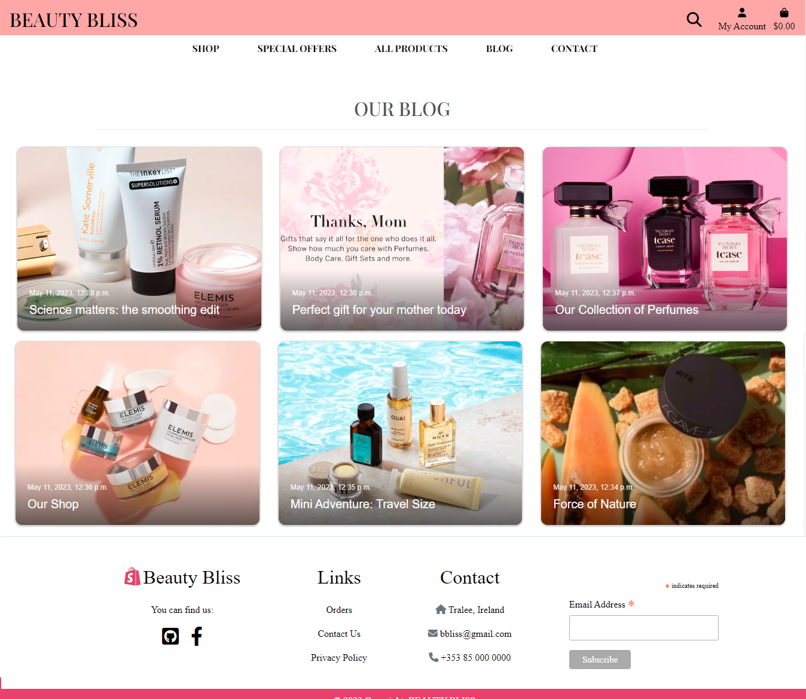

# Beauty Bliss Shop

**Developer: Kristina Orlichenko**

💻 [Visit live website](https://beautybliss.herokuapp.com/) 
 
💻 [Github Repository](https://github.com/Kristaal/ecommerce-website) 

## Table of Contents
- [Business Plan](#business-plan)
    - [Executive Summary](#executive-summary)
    - [Market Analysis](#market-analysis)
    - [Marketing and Sales Strategy](#marketing-and-sales-strategy)
    - [Operations and Management](#operations-and-management)
    - [Financial Plan](#financial-plan)
    - [Conclusion](#conclusion)
- [Marketing](#marketing)
    - [Mailing List](#mailing-list)
    - [Social Media](#social-media)
    - [Blog](#blog)
    - [Free Delivery](#free-delivery)
- [User Goals](#user-goals)
- [Site Owner Goals](#site-owner-goals)
- [User Experience](#user-experience)
    - [Target Audience](#target-audience)
    - [User Requirements and Expectations](#user-requirements-and-expectations)
- [User Stories](#user-stories)
    - [Kanban Epics and User Stories](#kanban-epics-user-stories)
- [Wireframes](#wireframes)
- [Design](#design)
    - [Colors](#colors)
    - [Fonts](#fonts)
- [Structure](#structure)
    - [Website pages](#website-pages)
- [AWS](#aws)
- [Database](#database)
- [Models](#models)
  - [Technologies Used](#technologies-used)
  - [Features](#features)
  - [Validation](#validation)
  - [Testing](#testing)
    - [Manual testing](#manual-testing)
    - [Automated testing](#automated-testing)
    - [Tests on various devices](#tests-on-various-devices)
    - [Browser compatibility](#browser-compatibility)
  - [Bugs](#bugs)
  - [Deployment](#deployment)
  - [Credits](#credits)
  - [Acknowledgements](#acknowledgements)

  

## Business Plan  
### Executive Summary:
Beauty Bliss is an online beauty shop that provides a wide range of beauty products to customers worldwide. Our mission is to offer high-quality beauty products at competitive prices while providing excellent customer service. We will achieve this by partnering with leading beauty brands and ensuring that our website is easy to navigate and user-friendly.

Our product range will include skincare, hair care, makeup, and fragrance products. We will offer a diverse range of products that cater to different skin types, hair textures, and personal preferences. Our team consists of experienced beauty professionals who will provide product recommendations and beauty advice to our customers.

Overall, Beauty Bliss aims to become a leading online beauty retailer by offering high-quality products, excellent customer service, and a user-friendly shopping experience.

### Market Analysis:
The beauty industry in Ireland is a growing market, driven by a growing population, increasing disposable incomes, and changing consumer preferences. The Irish beauty and personal care market was valued at €1.1 billion in 2019 and is expected to grow at a compound annual growth rate of 4.4% from 2020 to 2025.

The online beauty market in Ireland is also growing, with an increasing number of consumers turning to online shopping due to convenience, accessibility, and wider product options. According to a report by Mintel, 57% of Irish consumers purchased beauty products online in 2020, with skincare being the most popular category.

Beauty Bliss will target Irish consumers looking for high-quality beauty products at competitive prices. Our focus will be on providing a diverse range of products that cater to different skin types, hair textures, and personal preferences. We will also offer a range of international beauty brands that are not widely available in Ireland.

Overall, Beauty Bliss is well-positioned to capitalize on the growing demand for online beauty products in Ireland. We will leverage our competitive pricing, diverse product range, and excellent customer service to become a leading online beauty retailer in the Irish market.

### Marketing and Sales Strategy:
Our marketing and sales strategy for Beauty Bliss is focused on building brand awareness, driving traffic to our website, and providing a seamless customer experience that encourages repeat purchases. We will leverage online marketing channels and social media platforms such as SEO, PPC advertising, email marketing, Facebook, Instagram, and Twitter to reach our target audience and promote our high-quality and affordable beauty products.

### Operations and Management:
Beauty Bliss will be an online beauty shop, and our operations and management will be primarily focused on website management, product sourcing and inventory management, order fulfillment, customer service, and financial management.

We will leverage an e-commerce platform to manage our website, product listings, and orders. Our team will be responsible for managing our product inventory, ensuring that we have sufficient stock of our best-selling products, and sourcing new products that meet the needs and preferences of our customers.In terms of management, Beauty Bliss will be led by a team of experienced and dedicated individuals with a passion for the beauty industry. Our team will work together to execute our business plan, manage our operations, and provide our customers with the best possible shopping experience.

### Financial Plan:
The financial plan for Beauty Bliss is based on our projected revenue and expenses for the first three years of operation. Our revenue will come from online sales of beauty products, while our expenses will include the cost of goods sold, marketing expenses, website development and maintenance, and salaries.

Capital: €60,000

Revenue: €300,000 in Year 1

Gross Profit Margin: 40%

Average Fixed Cost: €30,000 per year

Average Variable Cost: €12,000 per year

Net Profit: €48,000 in Year 1

We will reinvest our profits back into the business to fund our growth and expansion plans.

Overall, our financial plan is based on realistic revenue and expense projections that are in line with industry averages and our expected growth rate. We will closely monitor our financial performance and adjust our strategies as needed to ensure the long-term success of Beauty Bliss.

### Conclusion:
Beauty Bliss is a promising online beauty shop that is poised for success in the Irish market. Our market analysis indicates that there is a growing demand for high-quality and affordable beauty products in Ireland, and we are well-positioned to meet this demand through our online platform.

We have developed a solid business plan that outlines our mission, goals, and strategies for achieving success. Our marketing and sales strategies are focused on building brand awareness, driving traffic to our website, and providing a seamless customer experience that encourages repeat purchases.

Our financial plan is based on realistic revenue and expense projections, and we will reinvest our profits back into the business to fund our growth and expansion plans. We will closely monitor our financial performance and adjust our strategies as needed to ensure the long-term success of Beauty Bliss.

In conclusion, we are excited about the potential of Beauty Bliss and look forward to serving the needs of the Irish market. We are committed to providing our customers with the highest quality beauty products, excellent customer service, and a convenient online shopping experience. With our dedicated team and strong business plan, we are confident that Beauty Bliss will become a leading online beauty shop in Ireland.

##### Back to [top](#table-of-contents)

## Marketing  

### Mailing List  

Beauty Bliss uses Mailchimp to manage its mailing list. By joining the mailing list, users will receive updates on new features, upcoming events, and exclusive promotions. The process to join the mailing list is simple, users just need to provide their email address on the website, and they will start receiving email updates. 

See Image

  

 
 

### Social Media  

The website Beauty Bliss has a presence on Facebook. The Facebook page serves as a platform to promote upcoming events, post updates on the latest features, and share user-generated content. This social media account allow users to stay informed.

[Facebook]()  

### Blog

Beauty Bliss provides a blog that will increase audience, attract buyers and increase sales.

See Image

  

 
 

### Free Delivery

We will offer free delivery on all orders above a certain threshold to incentivize customers to make a purchase. This will help us increase our average order value and encourage repeat purchases.

See Image

  

 
 

##### Back to [top](#table-of-contents)

## User Goals

## Site Owner Goals

## User Experience

### Target Audience

### User Requirements and Expectations

##### Back to [top](#table-of-contents)

## User Stories

### Kanban, Epics & User Stories

Epic Overview

Epic 1

Epic 2

Epic 3

Epic 4

User Stories

Kanban

##### Back to [top](#table-of-contents)

## Wireframes

## Design

### Colors

See Color Palette

### Fonts

See Font Image

# Structure

## Website pages

##### Back to [top](#table-of-contents)

## AWS 

See AWS Images

## Database

See Database Image

## Models  

### User Model

| Key        | Name         | Type        |
| ---------- | ------------ | ----------- |
|  |      |    |

### User Profile Model

| Key        | Name         | Type        |
| ---------- | ------------ | ----------- |
|  |      |    |

##### Back to [top](#table-of-contents)

## Technologies Used

### Languages & Frameworks

### Libraries & Tools

##### Back to [top](#table-of-contents)

## Features  

### Search Engine Optimisation (SEO)

See feature image

  

### Home page

See feature images

  

##### Back to [top](#table-of-contents)

# Validation  

## HTML Validation

##### Back to [top](#table-of-contents)
 

### CSS Validation

##### Back to [top](#table-of-contents)
 

### JavaScript Validation

##### Back to [top](#table-of-contents)
  

## PEP8 Validation

##### Back to [top](#table-of-contents)
  

## Accessibility  

##### Back to [top](#table-of-contents)
  

## Lighthouse

##### Back to [top](#table-of-contents)

## Testing

1. Manual testing User Stories
2. Automated testing

### Manual testing

### Automated testing

### Coverage  

### Device Testing & Browser compatibility

##### Back to [top](#table-of-contents)

## Bugs

##### Back to [top](#table-of-contents)

## Deployment  

##### Back to [top](#table-of-contents)

## Credits

### Code

### Media

##### Back to [top](#table-of-contents)

## Acknowledgements

### Special thanks to the following: